# Rapport d'Audit de Sécurité Android avec Drozer (Lab 9)

**Cours :** Sécurité des applications mobiles  
**Cible :** Sieve (com.withsecure.example.sieve)

---

## 1. Objectifs pédagogiques
* Maîtriser l'utilisation de Drozer pour l'analyse de surface d'attaque.
* Identifier les composants Android exposés (Activities, Providers, Services).
* Évaluer les risques selon les standards OWASP MASVS.
* Proposer des remédiations techniques concrètes.

---

## 2. Étape 1 : Configuration de l'environnement

L'installation a commencé par la mise en place de Drozer sur la machine hôte via Python, suivie de la vérification de la connectivité avec l'émulateur Android.

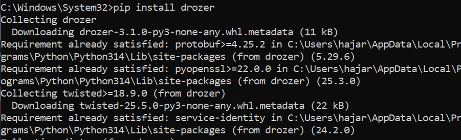
*Figure 1 : Installation de Drozer via pip sur Windows.*

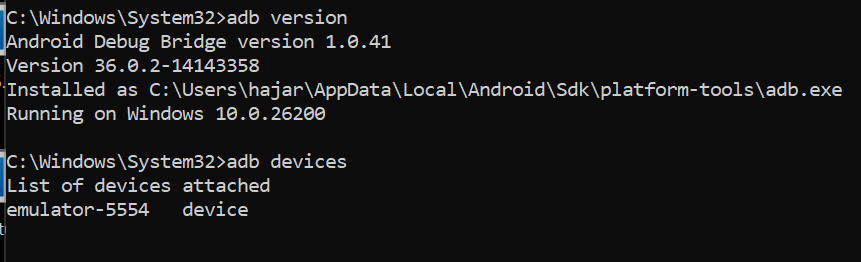
*Figure 2 : Vérification de la version ADB et détection de l'émulateur (emulator-5554).*

### Installation des composants sur l'émulateur
Nous avons installé l'application cible (**Sieve**) et l'agent de liaison (**Drozer Agent**).

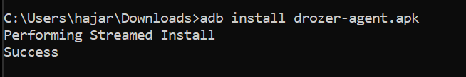
*Figure 3 : Installation réussie de sieve.apk.*

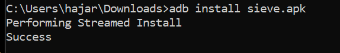
*Figure 4 : Installation réussie de drozer-agent.apk.*

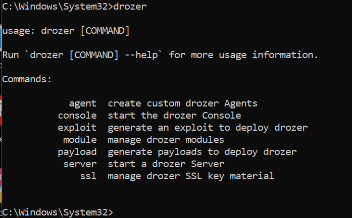
*Figure 5 : Validation de l'outil drozer sur la console Windows.*

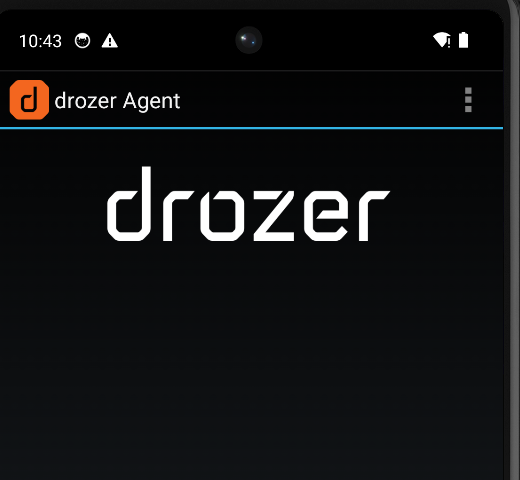

---

## 3. Étape 2 : Connexion et validation du canal

Après avoir activé le **Embedded Server** sur l'agent Drozer (Port 31415), nous avons établi le pont via ADB avec la commande `adb forward tcp:31415 tcp:31415`.

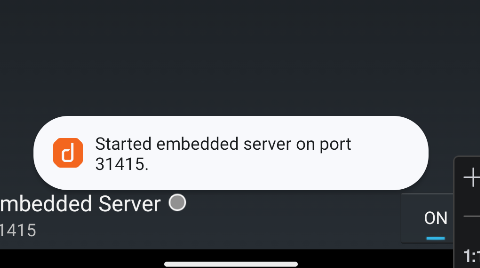
*Figure 6 : Connexion réussie à la console Drozer v3.1.0.*

---

## 4. Étape 3 : Cartographie des composants Android exposés
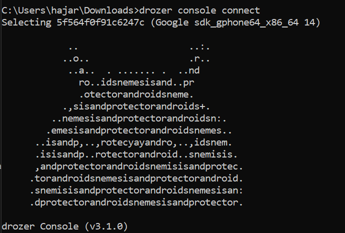

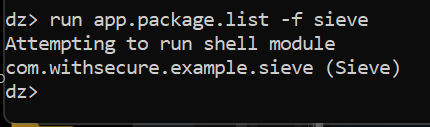
Nous avons analysé le package `com.withsecure.example.sieve` pour identifier sa surface d'attaque réelle.

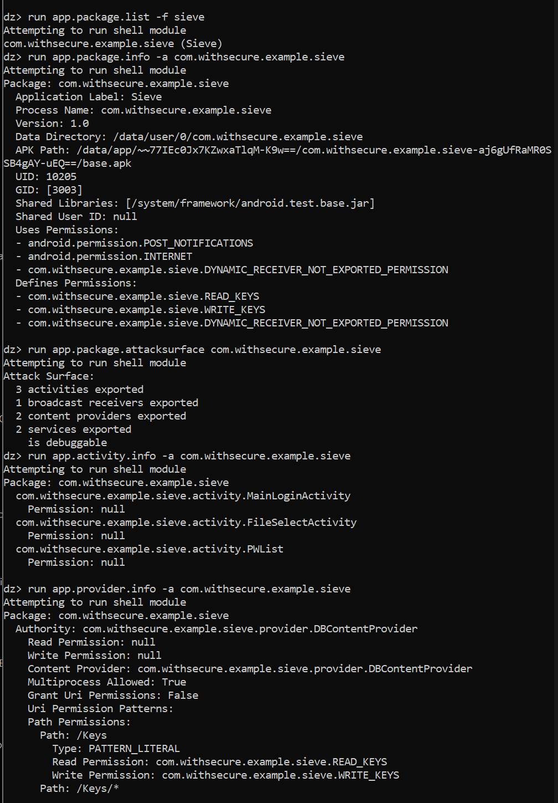
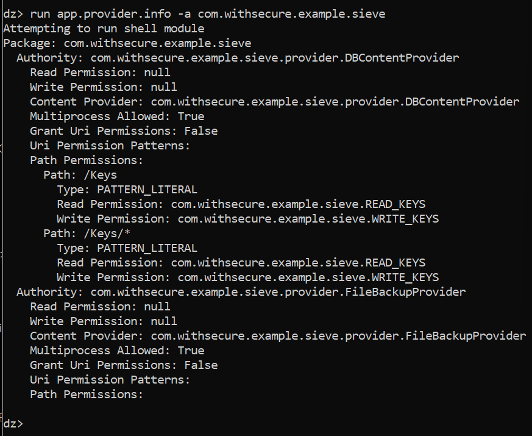
*Figure 7 : Résumé de la surface d'attaque identifiée par Drozer.*

**Résultats de la cartographie :**
* **3 activities exported** : Accessibles sans permissions (Bypass Login possible).
* **2 content providers exported** : Risque de lecture/écriture de données sensibles.
* **1 broadcast receiver** : Risque d'interception d'évènements système.
* **2 services exported** : Risque d'exécution de fonctionnalités en arrière-plan.
* **App is debuggable** : L'application autorise l'attachement d'un débogueur JDWP.

---

## 5. Étape 4 : Vérification des protections

L'analyse approfondie a été réalisée à l'aide des commandes suivantes pour vérifier les mécanismes de défense en place :

*   **Analyse du Manifeste** (Vérification des permissions globales et du flag debug) :
    `run app.package.manifest com.withsecure.example.sieve`
    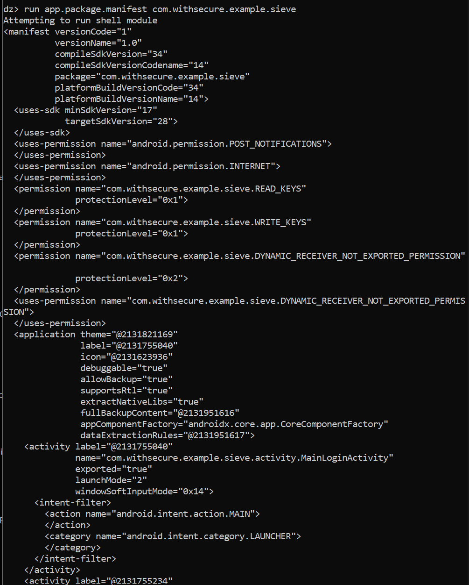

*   **Analyse des Activités** (Vérification des Intent-Filters et protections d'accès) :
    `run app.activity.info -a com.withsecure.example.sieve -i`
    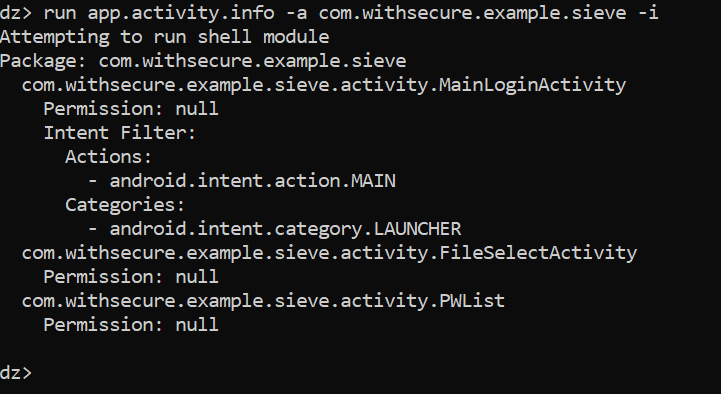

*   **Analyse des Providers** (Vérification des permissions de lecture/écriture) :
    `run app.provider.info -a com.withsecure.example.sieve`
    

*   **Analyse des Services** :
    `run app.service.info -a com.withsecure.example.sieve`
    

**Observation clé :** Ces captures d'écran confirment que les composants critiques sont marqués `exported="true"` mais affichent `Permission: null`. Cela prouve l'absence totale de protection, permettant à n'importe quelle application malveillante d'interagir avec ces composants.
---

## 6. Étape 5 & 6 : Analyse des risques et Collecte de preuves

Nous avons utilisé le module scanner de Drozer pour trouver les points d'entrée (URIs) et prouver l'accessibilité des données.

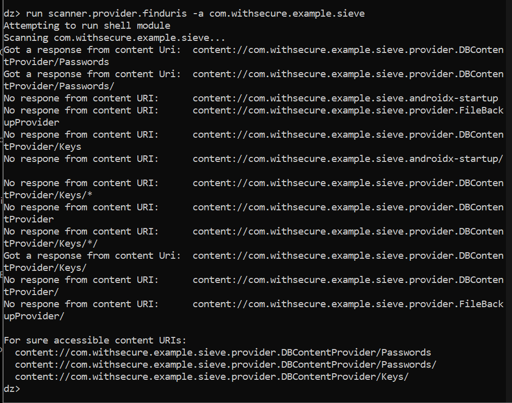
*Figure 10 : Identification des URIs accessibles (/Passwords et /Keys) prouvant la vulnérabilité.*

---

## 7. Section "Triage" (Priorisation des vulnérabilités)

| ID | Composant | Vulnérabilité | Confiance | Sévérité | Impact | Statut |
| :--- | :--- | :--- | :--- | :--- | :--- | :--- |
| **V1** | `DBContentProvider` | URIs `/Passwords` accessibles sans permission | Élevée | **Critique** | Fuite massive de données utilisateur | À corriger |
| **V2** | `PWList` | Activité exportée sans protection | Élevée | **Élevée** | Contournement total de l'authentification | À corriger |
| **V3** | `AndroidManifest` | Flag `debuggable="true"` activé | Élevée | **Élevée** | Analyse mémoire et injection facilitées | À corriger |
| **V4** | `DBContentProvider` | URIs `/Keys` accessibles sans permission | Élevée | **Critique** | Vol des clés de chiffrement de l'application | À corriger |

---

## 8. Mapping OWASP (MASVS/MASTG)

| ID | Vulnérabilité (Sieve) | Référence MASVS | Description |
| :--- | :--- | :--- | :--- |
| **V1** | Activities exportées | **MASVS-PLATFORM-1** | L'application expose des composants système inutiles. |
| **V2** | Content Providers mal protégés | **MASVS-STORAGE-2** | Stockage de données sensibles exposé via IPC. |
| **V3** | Debug Flag actif | **MASVS-RESILIENCE-1** | Faiblesse de configuration lors de la compilation. |
| **V4** | Permissions insuffisantes | **MASVS-PLATFORM-2** | Manque de validation des flux inter-processus (Intents). |

---

## 9. Remédiations détaillées

### 1. Sécurisation des Activities
Dans le fichier `AndroidManifest.xml`, désactiver l'exportation des écrans sensibles :
```xml
<!-- Avant -->
<activity android:name=".activity.PWList" android:exported="true" />

<!-- Après -->
<activity android:name=".activity.PWList" android:exported="false" />
```

### 2. Sécurisation des Content Providers
Restreindre l'accès à la base de données SQLite :
```xml
<!-- Après -->
<provider android:name=".provider.DBContentProvider" 
          android:authorities="com.withsecure.example.sieve.provider.DBContentProvider" 
          android:exported="false" />
```

### 3. Renforcement Global (Application)
* **Désactiver le debug** : Passer `android:debuggable` à `false` dans le tag `<application>`.
* **Signature Permissions** : Pour tout partage nécessaire, définir des permissions avec `protectionLevel="signature"`.

---

